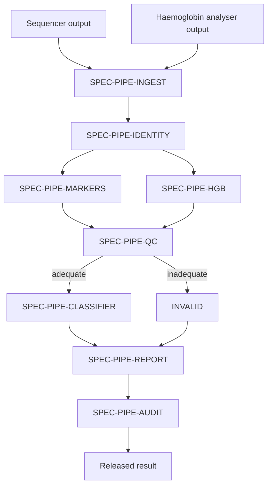

## Item fields

### Description

Reads the run manifest emitted by the sequencing instrument and the faecal haemoglobin
result file emitted by the immunochemical analyser, and normalises both into the internal
specimen record consumed by the rest of the pipeline.

Ingestion is the only module permitted to read instrument output directly. Every
downstream module operates on the normalised specimen record, so a change of instrument
platform is contained to this module.

## Architecture

### Inputs

Sequencer run manifest: accession identifier, per-marker methylated and total copy counts,
bisulfite conversion control status, total DNA input in nanograms.

Haemoglobin analyser output: accession identifier, haemoglobin concentration in nanograms
per millilitre.

### Outputs

A normalised specimen record carrying both accession identifiers, the raw marker counts,
the control status, the DNA input quantity, and the haemoglobin concentration.

Ingestion performs no interpretation. A malformed or unreadable input is surfaced as a
structural error rather than being coerced into a specimen record.

### Rationale

Confining instrument reads to a single module means a change of sequencing platform or
haemoglobin analyser is a change to one design output rather than to the whole pipeline.
It also gives the identity chain (SPEC-PIPE-IDENTITY) a single, well-defined place to read
both accession identifiers from, which is what makes deterministic mismatch detection
possible at all.
